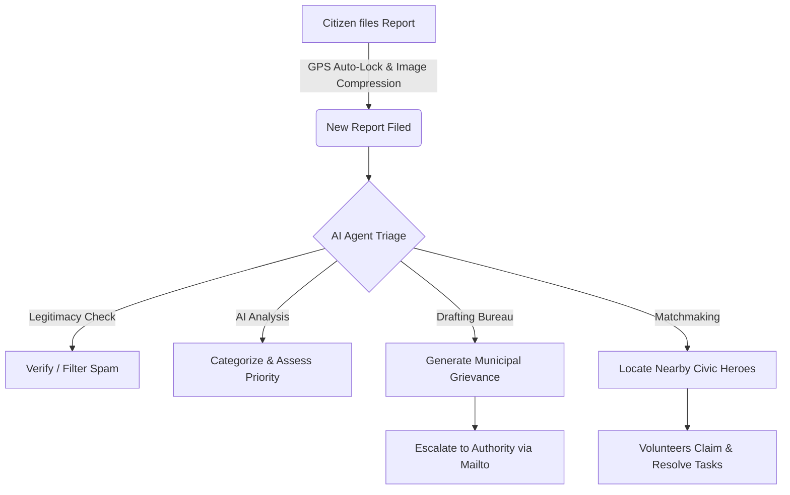

# CivicPulse | Hyperlocal Civic Action Hub

Welcome to **CivicPulse**, an autonomous city-desk triage assistant and community coordination platform designed to bridge the gap between citizens, local municipal departments, and neighbourhood volunteers.

This document serves as your complete guide to understanding **CivicPulse**: the problems it solves, how it works under the hood, user guides, and how to get it running.

---

## 1. The Core Problem & How CivicPulse Solves It

Hyperlocal hazard management in modern cities suffers from several critical bottlenecks:
*   **High Reporting Friction**: Citizens struggle to find the correct department, specify accurate geographic coordinates, or describe issues in formal terms.
*   **Administrative Bottlenecks**: City desks are flooded with duplicates, spam, and incomplete data, requiring manual triage.
*   **Under-Utilized Volunteers**: Local citizens want to help fix neighbourhood hazards (like a minor leakage or street cleanup) but lack a unified, real-time coordination dashboard.
*   **Friction in Formal Escalations**: Escalating unresolved issues to municipal authorities requires drafting formal grievance letters and finding correct email contacts.

### The CivicPulse Solution
CivicPulse automates this entire lifecycle by acting as an **Autonomous City-Desk Triage Agent** running directly in the browser:



---

## 2. Key Features

### 🧠 Autonomous Triage Pipeline (Google Gemini AI)
When a report is filed, the local desk deploys **Google Gemini 1.5 Flash** to run a comprehensive five-stage triage:
1.  **Planning**: Initializes the strategy based on coordinates and details.
2.  **Gemini Vision AI Check**: Scans attached photos to verify authenticity and filter out spam or jokes.
3.  **Triaging**: Evaluates the hazard priority (Low, Medium, High, Critical) and maps it to correct departments.
4.  **Complaint Bureau**: Drafts a formal municipal grievance letter containing locations, dates, and incident details.
5.  **Hero Match**: Queries the local volunteer registry to find nearby users with relevant skills (e.g. electrical work, plumbing, sanitation).

### 📍 GPS Geolocation Lock
No more guessing coordinates. Using the browser's native **Geolocation API**, CivicPulse prompts the user for GPS permission when they file a report, auto-locking the map pin to their exact longitude and latitude.

### 🖼️ Canvas-Based Image Compression
To prevent high-resolution photos and webcam streams from crashing the browser's storage database (`localStorage`), the uploader dynamically downscales all images to a maximum dimension of 300px on the fly. This compresses files from megabytes to ~15KB while maintaining visual utility.

### ✉️ Actionable Grievance Hub
Citizens can download the formal complaint as a `.txt` file, copy it to their clipboard, or click **"Email Authority"**. The email link pre-populates the correct division address (e.g., `waste@municipal.gov` for garbage piles), subject line, and draft body in the user's default mail app.

### 💬 Community Timeline Updates
Citizens can leave status comments on active issues (e.g., *"Sanitation officer visited the block today"*). This timeline creates a collaborative paper trail for community transparency.

### 🔮 Predictive Risk Heatmaps
By analyzing historic coordinate density and category spreads, CivicPulse renders large, pulsed hotspot rings on the map to visualize threat propagation zones (like monsoon water-logging risk or road decay zones).

---

## 3. Step-by-Step User Guide

### Step 1: Account Creation & OTP Verification
1.  Navigate to the app homepage.
2.  Look at the **User Profile Card** in the top-right corner. It will show a warning: **Unverified Citizen**.
3.  Click anywhere on the profile card to open the **Create Civic Account** modal.
4.  Enter your **Full Name**, **Email**, and **Password**.
5.  *(Optional)* Type a nickname or keyword in the **Avatar Seed** field to watch your pixel-art avatar dynamically regenerate!
6.  Click **Create Account**.
7.  A verification stage will appear. CivicPulse will simulate sending a code to your email.
8.  Enter the demo verification passcode **`1234`** and click **Verify & Activate**.
9.  Your profile card now displays a green **Verified** check circle, and your name is synchronized with the leaderboard.

---

### Step 2: Reporting a New Hazard
1.  Click the blue **"Report Issue"** button in the header.
2.  Your browser will ask for location permission. Click **Allow** to lock your GPS coordinates.
3.  Enter an **Issue Title** (e.g. "Clogged water main leak") and select the correct **Category**.
4.  Choose your incident photo mode:
    *   **Presets**: Choose one of our pre-made vector graphics.
    *   **Upload File**: Drag-and-drop or upload a file. The app will automatically compress it.
    *   **Use Camera**: Click "Start Camera", align the hazard, and click "Capture".
5.  Enter details in the **Description** and set the **Severity** slider (1-4).
6.  Click **File Report**. The report is pinned to the map and added to the left-side feed.
7.  *Tip:* If you need to fine-tune the geographic location, click the report in the feed, then click any spot on the map to reposition the pin.

---

### Step 3: Activating the Autonomous Agent
1.  Select your new report from the feed.
2.  In the center console, click the **"Run Triage Agent"** button.
3.  Watch the terminal stream the autonomous logs as it planning, validates pixels, scales priority, drafts the report, and maps volunteers.
4.  Click the **"View Agent Outputs"** button.
5.  Switch between:
    *   **Vision AI Tags**: Technical tags and confidence ratings.
    *   **Draft Grievance**: The formal letter. Click **Copy**, **Download**, or **Email Authority** to escalate.
    *   **Matched Heroes**: Recommended volunteers nearby.

---

### Step 4: Volunteering in "Hero Mode"
1.  Toggle **"Hero Mode"** in the top header.
2.  Your rank switches to **Civic Hero**, and your right-hand panel turns into a **Volunteer Task Board**.
3.  Locate an issue and click **"Claim"** to assign it to yourself.
4.  Once you visit the location and clear the hazard, select the task and click **"Complete"**.
5.  You earn impact points (+75 points for critical hazards), which instantly updates the Leaderboard and unlocks achievements.

---

## 4. Administrative & API Configurations

### Setting Up a Live Gemini API Key
To connect the app to live generative models instead of simulated sandboxes:
1.  Click the **Gear Icon** in the header.
2.  Input your **Google Gemini API Key** (you can generate one for free inside [Google AI Studio](https://aistudio.google.com/)).
3.  Check **"Enable Live Gemini Mode"**.
4.  Click **Save Settings**.
5.  Now, running the triage agent will send real base64 image packets to Gemini 1.5 Flash for authentic municipal verification!

---

## 5. Deployment Guide

CivicPulse is designed as a single-page application (SPA), meaning it requires no backend databases or node servers to run in production.

### Local Hosting (Quickstart)
To run local webcam and GPS modules, serve the folder via a local server:
```bash
# Serve current folder using node's serve utility on port 3000
npx -y serve -l 3000
```
Open `http://localhost:3000` in your browser.

### Hosting in Production (Netlify / Vercel / GitHub Pages)
Because the codebase consists of static assets:
1.  **Vercel**: Deploy instantly by pushing to GitHub and linking to a Vercel project, or running `vercel --prod` in the CLI.
2.  **GitHub Pages**: Push your files to a GitHub repository, go to **Settings > Pages**, choose `main branch` and folder `/ (root)`, and save.
3.  **Netlify**: Drag-and-drop the directory directly into the Netlify dashboard.
